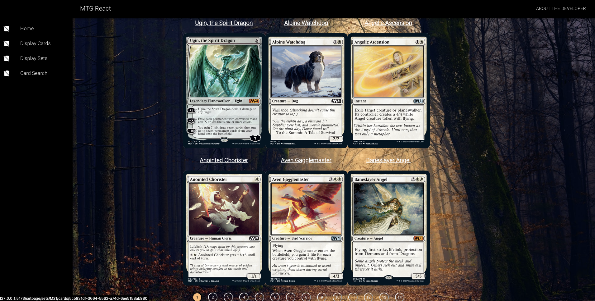
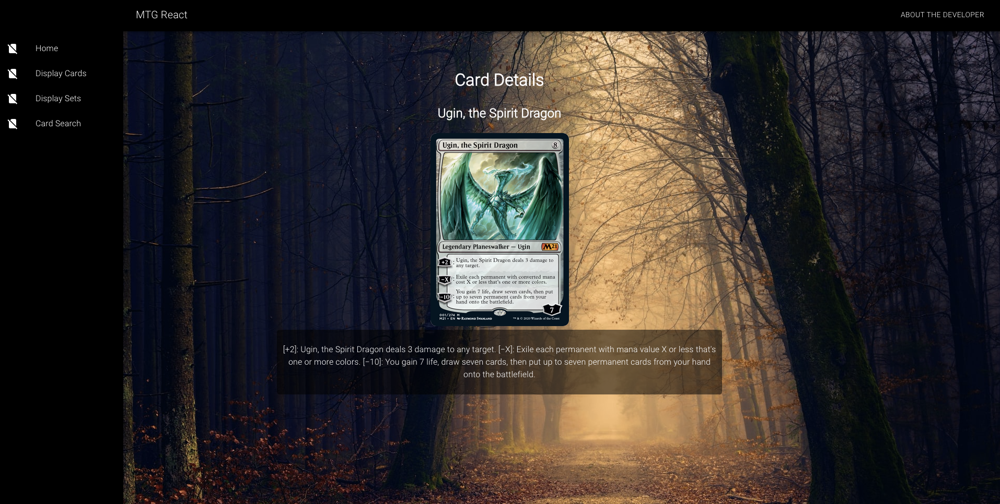
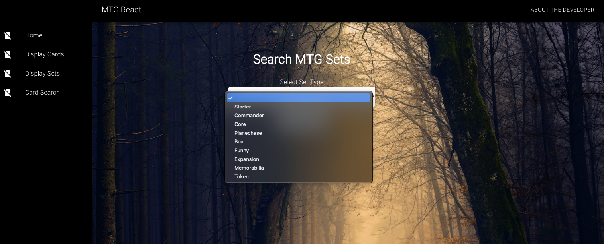

# MTG React App

---

# Project Overview

This is a React app that pays tribute to one of my favorite cards games - Magic the Gathering!

This project employs the use of React Router, Material UI, useQuery, Pagination, and API requests.

---

## Features

- Search cards by set
- View details for specific cards
- API requests
- Material UI for responsiveness and layout

Cards Display Page:

Cards Detail Page:

Set Search Page:

## Technologies

**Languages/Frameworks/Database:** React, React Router, useQuery, API requests, Material UI

# Learn More About the Developer

**GitHub:** https://github.com/kotynskm
**LinkedIn:** https://www.linkedin.com/in/kkotynski
**Medium:** https://medium.com/@k.kotynski
**Portfolio:** https://kotynskm.github.io/portfolio-website/
