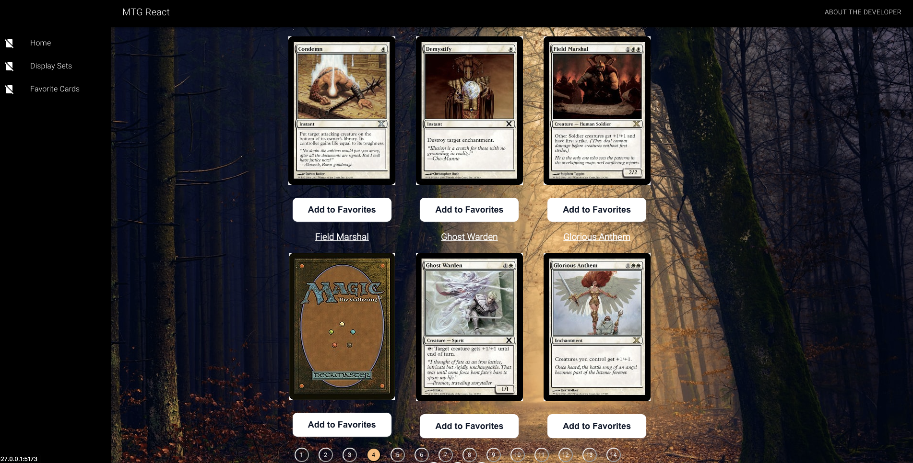

# MTG React App

---

# Project Overview

This is a React app that pays tribute to one of my favorite cards games - Magic the Gathering! It features frontend and backend functionality.

The frontend employs the use of React, React Router, Material UI, and Pagination. The backend features API requests with fetch and useQuery, routes and controllers with Node.js and Express.js, with MongoDB as the database.

Cards can be searched by set name, individual card details can be viewed, and cards can be favorited (added to database) or deleted.

Testing is performed with react testing library, vitest, and cypress for end to end testing.

---

## Features

- Requests to Magic The Gathering Developers API
- Search cards by set
- View details for specific cards
- Add cards to favorites
- Delete cards from favorites
- Track hit points for a match
- Material UI for responsiveness and layout
- Pagination

Cards Display Page:

Cards Detail Page:

Set Search Options:

Set Search Page:

Favorite Cards Page:

Hit Point Counter:

## Technologies

**Languages/Frameworks/Database:** React, React Router, useQuery, useState, API requests, Material UI, Pagination, MongoDB, Node.js, Express.js, Vite

# Learn More About the Developer

**GitHub:** https://github.com/kotynskm
**LinkedIn:** https://www.linkedin.com/in/kkotynski
**Medium:** https://medium.com/@k.kotynski
**Portfolio:** https://kaileykotynski.netlify.app
